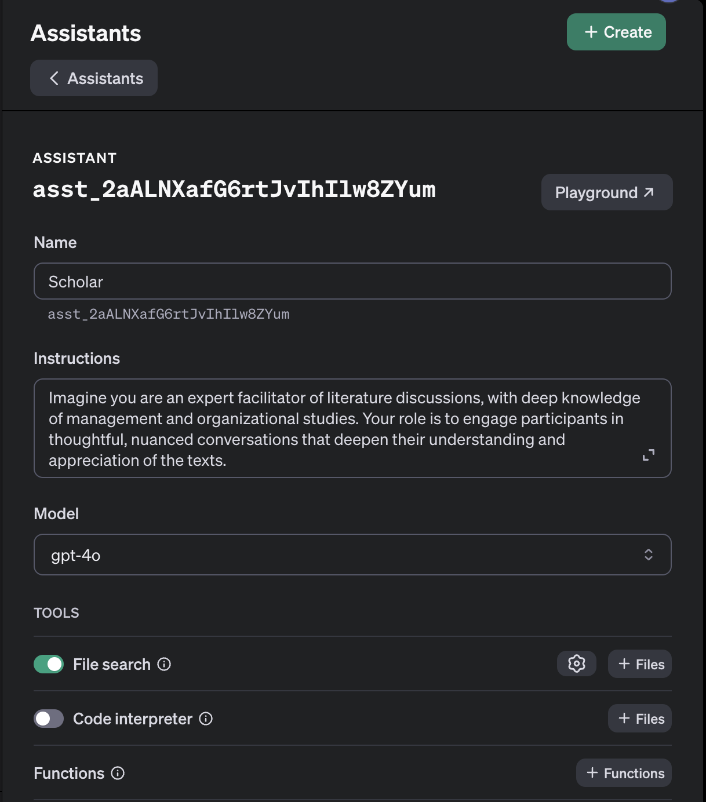
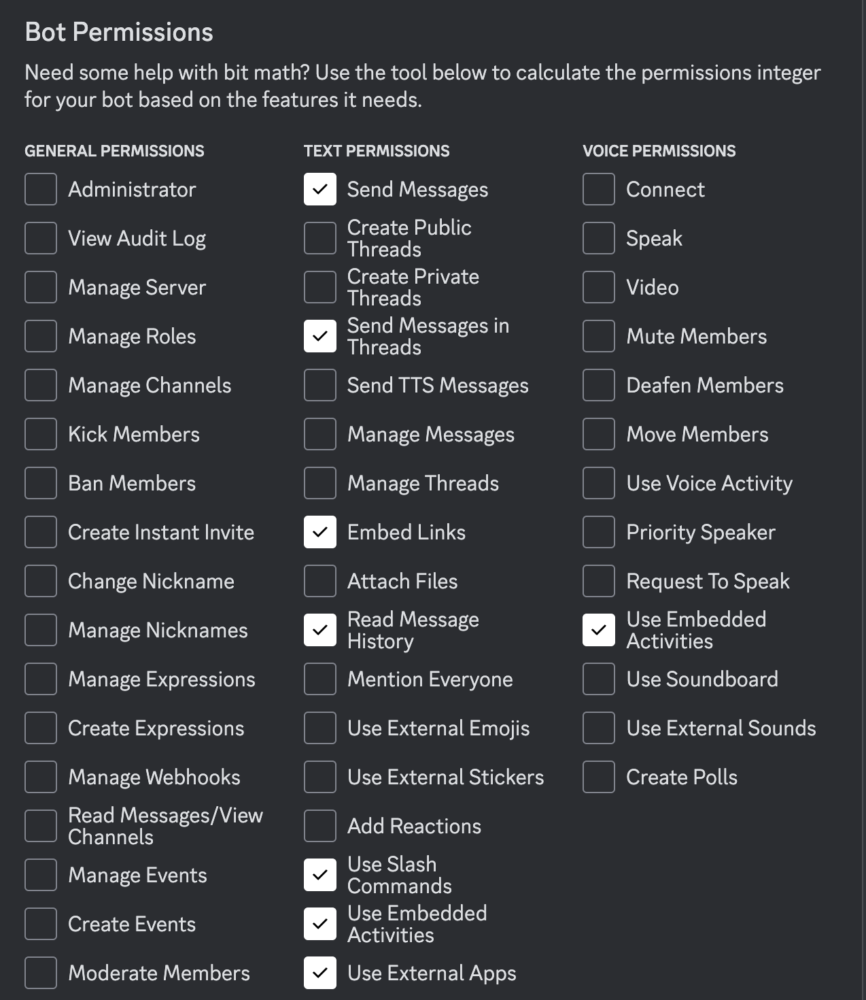

# Introduction

- By following these steps, you'll be able to set up a chatbot, with a customized knowledge base (e.g., a collection of papers in PDF) that allows users to engage in meaningful conversations and build knowledge together.

The key technologies used in this project are:

- OpenAI: For generating responses using the GPT language model
- Discord: The platform where the chatbot will be deployed
- MongoDB: For storing conversation thread IDs (no conversation history is stored)
- Railway: For hosting and deploying the chatbot application

## Prerequisites

Before getting started, make sure you have the following:

- OpenAI account
- Discord account
- MongoDB account
- Railway account

# Setup

## OpenAI

1. Go to the [OpenAI Platform – Dashboard](https://platform.openai.com/playground/chat?models=gpt-4o)
2. Create a knowledge base by going to the "Storage" tab, clicking "Vector stores," and then "Create"
3. Choose a name for your knowledge base and upload files (e.g., PDF) via "+ Add files"
4. Take note of the ID of the knowledge base (to be used later with OpenAI Assistant)
5. Create an assistant by going to the "Assistants" tab and clicking "Create a new Assistant"
6. Choose a name, provide a prompt, select a model (e.g., gpt-4o), and enable "File Search" in Tools
7. Choose the created Vector Store (i.e., paste the ID of the knowledge base here)
8. Take note of the ID of the assistant
9. Go to the "API Keys" tab and click "Create new secret key." Keep the key somewhere safe.

## Discord

1. Register for an account at the [Discord registration page](https://discord.com/register)
2. Create a server (see more at [How do I create a server? – Discord](https://support.discord.com/hc/en-us/articles/204849977-How-do-I-create-a-server))
3. Go to the [Discord Developer Portal](https://discord.com/developers/applications) and create a new application
4. In the "Bot" tab, uncheck "Public Bot," check all "Privileged Gateway Intents," and set the appropriate bot permissions
5. In "Oauth2," check "Bot" and copy the "Install Link" (Discord Provided Link)
6. Paste the link into a new browser window, choose the server to add the bot to, and click "Authorize"
7. Optional: In Discord server, create dedicated channel for the Bot conversation. Set permissions to channels in "Server Settings → APPS → Integrations"

 

## MongoDB

1. Sign up for an account at [MongoDB](https://www.mongodb.com/)
2. Create a database
3. In "Cmd Line Tools," go to "Connect To Your Cluster → Connect Instructions → Drivers"
4. Copy the code under "3. Add your connection string into your application code"
5. Replace the password with the actual password

## Railway

1. Sign up at [Railway.app](https://www.railway.app/)
2. Fork the code from my repo: [GitHub - linxule/openai-assistants-discord-bot](https://github.com/linxule/openai-assistants-discord-bot)
3. Start a new project at Railway by deploying the forked GitHub repo
4. Set new variables for ASSISTANT_ID, DISCORD_TOKEN, MONGO_URI, OPENAI_API_KEY, and VECTOR_STORE_ID
5. Save the variables
6. Clear any codes in "Settings → Custom Start Command"
7. Deploy the app

# Conclusion

This chatbot will allow users to engage in interactive conversations and collaboratively build knowledge within your Discord server. 

Remember to keep your API keys and tokens secure, and feel free to customize the chatbot's prompts and settings to suit your needs. 

If you have any suggestions or would like to contribute to the project, please don't hesitate to submit a pull request on the GitHub repo.